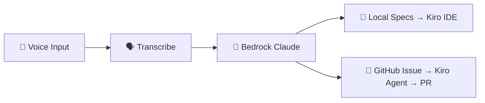

# 🎤 Voice Driven Development with Kiro Autonomous Agents

> Convert spoken requirements into structured specifications or GitHub issues using AI transcription and LLM processing.

[](https://github.com/aws-samples/sample-voice-driven-development/actions/workflows/bandit.yml)
[](LICENSE)
[](https://www.python.org/downloads/)

Speak your ideas, and this app turns them into actionable work. Record or upload audio, and the app transcribes your words and uses AI to generate structured requirements — or creates a GitHub issue that [Kiro's Autonomous Agent](https://kiro.dev/autonomous-agent/) picks up, implements, and delivers as a Pull Request. No typing required.

In **Local mode**, the generated specs drive [Kiro IDE](https://kiro.dev/docs/) to implement the entire application through specs-driven development. In **GitHub mode**, Kiro's Autonomous Agent picks up the issue and raises a PR automatically.

> 🤖 **Fun fact:** This entire project was created using [Kiro](https://kiro.dev), an AI-powered development assistant that helped design, implement, and document the application from initial concept to deployment.

---

## ✨ Features

| Feature | Description |
|---------|-------------|
| 🎙️ Browser Recording | Record requirements directly from your microphone |
| 📁 File Upload | Upload `.wav` audio files |
| ☁️ Amazon Transcribe | Cloud-based speech-to-text |
| 🦜 Parakeet MLX | On-device transcription for Apple Silicon (optional) |
| 📝 Local Mode | Generate `requirements.md` + `tasks.md` in Kiro spec format |
| 🐙 GitHub Mode | Create GitHub issues directly from voice input |
| 🤖 Configurable Model | Use any Bedrock model (Claude Haiku, Sonnet, etc.) |

---

## 📋 Prerequisites

- [uv](https://docs.astral.sh/uv/getting-started/installation/) package manager
- Python 3.12+
- AWS account with access to:
  - **S3** — audio file storage
  - **Amazon Transcribe** — speech-to-text
  - **Amazon Bedrock** — LLM inference (Claude model access required)
- AWS credentials configured (`~/.aws/credentials` or environment variables)

---

## 🚀 Quick Start

### 1. Clone & install

```bash
git clone https://github.com/aws-samples/sample-voice-driven-development.git
cd sample-voice-driven-development
uv sync
```

### 2. Configure environment

```bash
cp .env.example .env
```

Edit `.env` with your values:

```env
S3_BUCKET_NAME=your-s3-bucket-name
BEDROCK_MODEL_ID=eu.anthropic.claude-haiku-4-5-20251001-v1:0

# Optional: GitHub issue creation mode
GITHUB_TOKEN=ghp_your_token_here
GITHUB_REPO=owner/repo
```

### 3. Run

```bash
uv run streamlit run streamlit_app.py
```

Open [http://localhost:8501](http://localhost:8501) in your browser.

---

## 🐳 Docker

**With AWS credentials volume mount:**

```bash
docker build -t voice-driven-dev .
docker run -p 8501:8501 \
  -e S3_BUCKET_NAME=your-bucket \
  -v ~/.aws:/home/appuser/.aws:ro \
  -v $(pwd)/projects:/app/projects \
  voice-driven-dev
```

**With environment variables:**

```bash
docker run -p 8501:8501 \
  -e AWS_ACCESS_KEY_ID=your_key \
  -e AWS_SECRET_ACCESS_KEY=your_secret \
  -e S3_BUCKET_NAME=your-bucket \
  -v $(pwd)/projects:/app/projects \
  voice-driven-dev
```

---

## 🎯 Usage

1. **Choose input** — Record audio via microphone or upload a `.wav` file
2. **Select output mode** — Local (specs + tasks) or GitHub (issue creation)
3. **Process** — Click the process button to transcribe and generate output
4. **Download** — Get your `requirements.md`, `tasks.md`, or view the GitHub issue

### Output Modes

| Mode | Output | Requires |
|------|--------|----------|
| **Local** | `projects/<name>/requirements.md` + `tasks.md` | S3 bucket |
| **GitHub** | GitHub issue with `kiro` label — triggers Kiro Autonomous Agent to pick up and implement the task | `GITHUB_TOKEN` + `GITHUB_REPO` |

---

## 🦜 Local Transcription (Optional)

For on-device transcription on Apple Silicon (skips S3 + Transcribe entirely):

```bash
brew install ffmpeg
uv sync --extra local-transcribe
```

Select **Parakeet MLX** in the sidebar transcription engine dropdown.

---

## 🤖 Kiro Autonomous Agent Mode (Optional)

Use **Kiro's Autonomous Agent** to close the loop entirely — speak your requirements, have them logged as GitHub issues, and let Kiro automatically pick them up, implement the code, and raise a Pull Request.

### How it works

```
🎤 Voice Input ──▶ 🐙 GitHub Issue ──▶ 🤖 Kiro Agent ──▶ 📦 Pull Request
```

1. You speak your requirements into the Streamlit app (GitHub mode)
2. The app creates a GitHub issue with structured acceptance criteria
3. Kiro Autonomous Agent detects the new issue and starts working on it
4. Kiro implements the changes and opens a PR for your review

### Setup

#### Step 1: Connect Kiro Autonomous Agent to your GitHub repo

Follow the [Kiro Autonomous Agent docs](https://kiro.dev/docs/autonomous-agent/) to set up:

1. Open [Kiro](https://kiro.dev) and navigate to **Autonomous Agent**
2. Connect your GitHub account and select the target repository
3. Configure which issue labels Kiro should pick up (e.g., `kiro`)

#### Step 2: Generate a GitHub Personal Access Token

1. Go to [GitHub → Settings → Developer settings → Personal access tokens](https://github.com/settings/tokens)
2. Create a **Fine-grained token** scoped to your target repository with:
   - **Issues**: Read & Write
3. Copy the token

#### Step 3: Configure the app for GitHub mode

Add the token and repo to your `.env`:

```env
GITHUB_TOKEN=github_pat_xxxxxxxxxxxx
GITHUB_REPO=owner/repo
```

#### Step 4: Use the app in GitHub mode

1. Run the app: `uv run streamlit run streamlit_app.py`
2. In the sidebar, select **🐙 GitHub — open issue directly**
3. Record or upload your audio requirements
4. Click **Process** — a GitHub issue is created with the `kiro` label
5. Kiro Autonomous Agent picks up the issue, implements the code, and opens a PR

> 💡 **Tip:** The app automatically applies the `kiro` label to created issues. Make sure your Kiro Agent is configured to watch for this label so it triggers automatically.

---

## 🏗️ Architecture



---

## 🔐 AWS Permissions

Your IAM credentials need the following permissions:

| Service | Actions |
|---------|---------|
| **S3** | `s3:PutObject`, `s3:GetObject` on your bucket |
| **Transcribe** | `transcribe:StartTranscriptionJob`, `transcribe:GetTranscriptionJob` |
| **Bedrock** | `bedrock:InvokeModel` for your configured model |

---

## ⚙️ Configuration Reference

| Variable | Required | Default | Description |
|----------|----------|---------|-------------|
| `S3_BUCKET_NAME` | Yes* | — | S3 bucket for audio storage |
| `BEDROCK_MODEL_ID` | No | `eu.anthropic.claude-haiku-4-5-20251001-v1:0` | Bedrock model ID |
| `AWS_REGION` | No | Auto-resolved from model prefix | AWS region override |
| `GITHUB_TOKEN` | No | — | Enables GitHub issue mode |
| `GITHUB_REPO` | No | — | Target repo (`owner/repo`) |
| `PARAKEET_MODEL_ID` | No | `mlx-community/parakeet-tdt-0.6b-v2` | Local transcription model |

\* Not required when using Parakeet MLX engine in local-only mode.

---

## 📚 Resources

- [Kiro IDE Docs](https://kiro.dev/docs/) — Specs-driven development with Kiro
- [Kiro Autonomous Agent Docs](https://kiro.dev/docs/autonomous-agent/) — Let Kiro pick up GitHub issues and raise PRs
- [Kiro Blog](https://kiro.dev/blog/) — News, tutorials, updates from the Kiro team - find it all here

---

## 🤝 Contributing

See [CONTRIBUTING.md](CONTRIBUTING.md) for guidelines.

---

## 🔒 Security

See [CONTRIBUTING.md](CONTRIBUTING.md#security-issue-notifications) for reporting vulnerabilities.

---

## 📄 License

This project is licensed under the [MIT-0 License](LICENSE).
